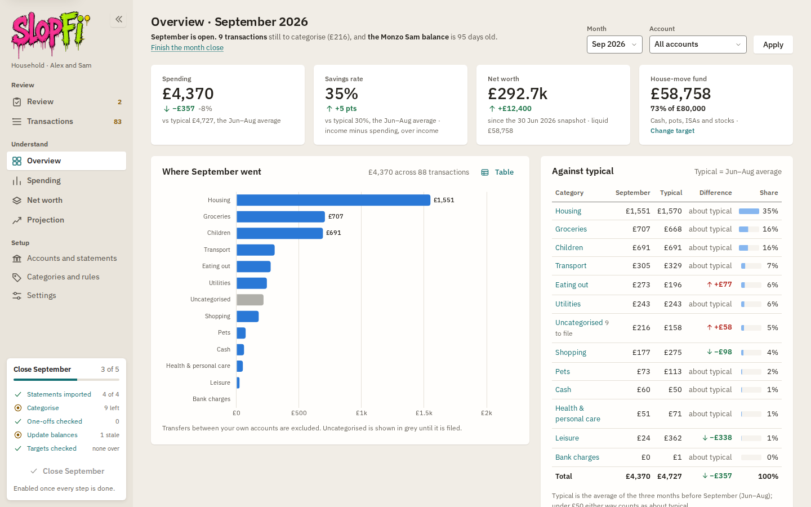
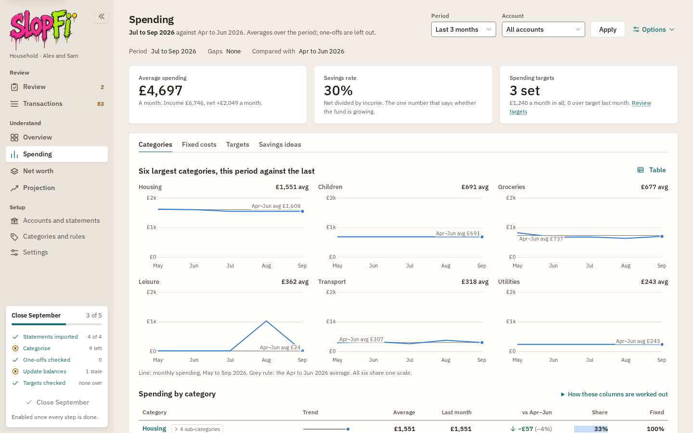
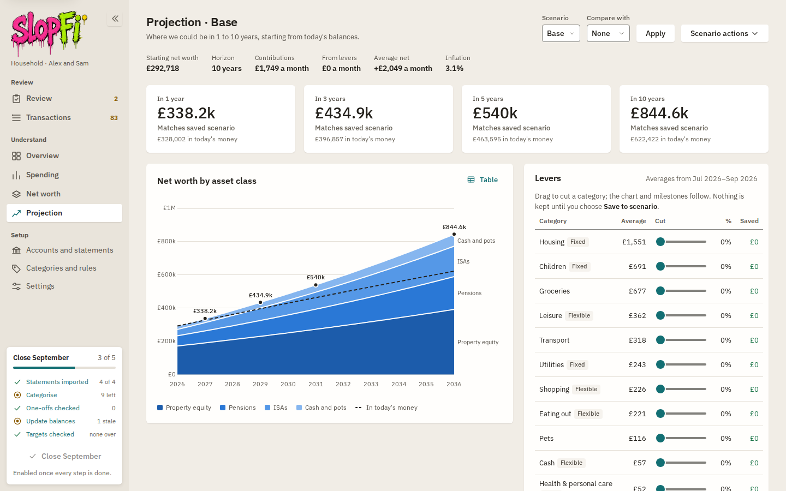
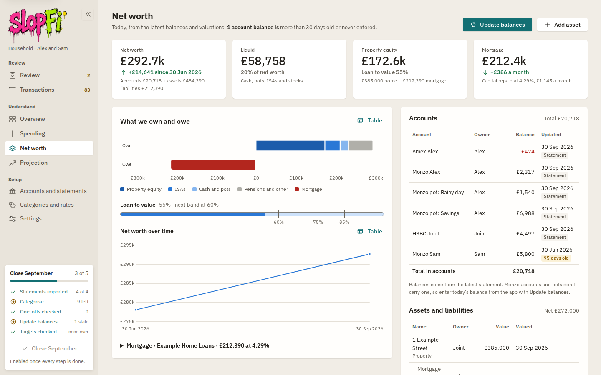
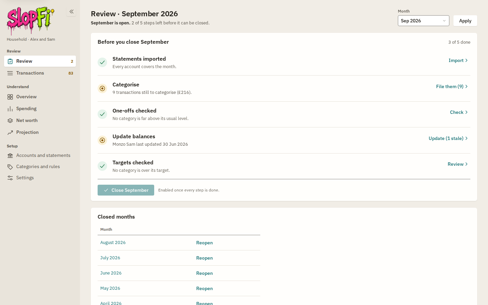

<p align="center">
  
</p>

<p align="center"><em>Household finance, lovingly vibe coded. Not for prod.</em></p>

# slopFi

Parse bank statements, categorise every transaction, and see where the money goes,
all in a local web UI backed by a single SQLite file. Nothing leaves your machine.

<p align="center">
  
</p>

| | |
|---|---|
|  |  |
|  |  |

All screenshots show the built-in demo household; every name, number and account is made up.

## Setup

Requires [uv](https://docs.astral.sh/uv/). Python 3.12 is fetched automatically.

```bash
uv sync
```

## Try the demo

```bash
uv run slopfi demo                                   # writes ./demo: statements, sources.toml, rules.json, a database
SLOPFI_DB=demo/slopfi-demo.db uv run slopfi serve    # or simply: uv run slopfi serve --demo
```

The demo is a fictional household (the Riveras: Alex and Sam) with twelve months of statements in every supported
format: a joint HSBC-style current account (one PDF a month), Alex's Monzo-style account with two pots (one PDF for
the year), Sam's Monzo-style CSV export and Alex's Amex-style credit card (one PDF a month). Every name, sort code
and account number is made up. The build is deterministic: `--seed N` picks a different household, `--out DIR`
writes somewhere else, `--force` rebuilds. Some merchants are deliberately left without a rule, so the latest
month has work on the Review checklist.

## Use

```bash
uv run slopfi sync               # import every file listed in sources.toml (safe to re-run)
uv run slopfi sync --fresh       # delete the database and rebuild it from scratch
uv run slopfi serve              # http://127.0.0.1:8000
uv run slopfi summary            # monthly totals in the terminal
uv run slopfi apply-rules        # categorise anything still uncategorised
uv run slopfi rules export rules.local.json     # save every rule as JSON
uv run slopfi rules import rules.local.json     # add rules from a file (duplicates skipped; --replace to start over)
uv run pytest                      # tests (real statements are used when present under data/)
```

`sources.toml` maps each statement folder to an account (name, owner, kind); copy `sources.example.toml` to start.
A top-level `rules_file = "rules.local.json"` makes every `sync` import and apply that rules file too. Drop new
statements into the right folder and run `sync` again, or press **Import from configured folders**
on Accounts and statements. Files already imported are skipped, so re-running is harmless.
`--fresh` throws away manual categorisations and rules you added, so prefer a plain `sync`.

One-off imports outside the config:

```bash
uv run slopfi import data/alex/amex                                           # PDFs auto-detect their account
uv run slopfi import --account "Monzo Sam" --owner sam data/sam/monzo         # CSV exports need an account
```

The database is `slopfi.db` in the working directory (override with `SLOPFI_DB=path`).
`data/` and `*.db` are git-ignored: they contain personal details.

## Using the app

`uv run slopfi serve` and open http://127.0.0.1:8000. A sidebar on every page carries three groups and,
at its foot, the month-close checklist for the latest open month ("Close September · 3 of 5"); each row
links to the page that clears it, and the counts update as you work. Below 1024px the sidebar becomes an
icon rail (the checklist moves to the top of Overview); below 768px it becomes a top bar.

### Closing a month

Once a month, when the statements are in, work down the checklist:

1. **Review** shows the five steps for the month with what is still outstanding: statements imported
   (every account covers the month), transactions categorised, one-offs checked, balances updated
   (none older than 30 days), targets checked.
2. **Transactions** opens on that month. File the uncategorised rows (they are tinted and open for
   editing), tick **Make a rule** to file every matching description the same way, and mark bonuses,
   refunds and other unusual payments **One-off** so they stay out of averages and projections.
3. **Spending** checks the period's averages against the one before, the fixed costs, and any
   category over its target.
4. **Net worth**: press **Update balances** for accounts whose statements carry no balance (Monzo pots,
   for example) and revalue the house or investments with **Add asset** or the row's **Edit**.
5. **Close** the month from Review (or the checklist card) once every step is done. Spending then counts
   the month in its averages even if a statement left a gap, Overview's status line says the month is
   closed, and the checklist moves on to the next month. **Reopen** puts a month back on the checklist.

### The pages

| Group | Page | What it is for |
|---|---|---|
| Review | **Review** | The month-close checklist in full, with the action that clears each step; close or reopen a month. |
| Review | **Transactions** | Every transaction for a month (or all time): filter, search, categorise one by one or in bulk, mark one-offs, export CSV. |
| Understand | **Overview** | One month at a glance: spending and savings rate against typical (the average of the three complete months before), net worth, where the money went, six months, largest payments. |
| Understand | **Spending** | Averages per category over the last 3, 6 or 12 complete months against the period before, with tabs for **Categories** (small multiples, the full table, month by month), **Fixed costs** (recurring payments), **Targets** (monthly ceilings per category) and **Savings ideas**. |
| Understand | **Net worth** | What we own and owe today: account balances, the house and mortgage, ISAs, pensions and loans, loan to value, and the history as each update is kept. |
| Understand | **Projection** | Today's balance sheet run forward 1 to 10 years per scenario: growth, contributions, the mortgage paying down, spending levers that cut a category and show the effect as you drag, and what happens to the monthly surplus. Duplicate a scenario to compare. |
| Setup | **Accounts and statements** | Import statement files or everything in `sources.toml` (**Import from configured folders**), see what is imported, rename accounts, delete a statement. |
| Setup | **Categories and rules** | The category tree, and the rules that file transactions automatically (priority order, first match wins); switch a rule off without deleting it; export the rules as JSON or import a rules file. |
| Setup | **Settings** | The household (its name and the people who own accounts: each is an owner choice beside Joint and Unknown), and projection defaults: inflation, horizon, and the interest or growth rate for each kind of account and asset. |

Every chart has a **Table** button showing the same figures as a table. Deletes always ask first and
say what goes with the item; saves confirm with a short message at the bottom left.

### Keyboard shortcuts on Transactions

| Key | Does |
|---|---|
| `j` / `k` | Next / previous row |
| `c` or `Enter` | Change the category of the current row |
| `o` | Mark or unmark the row as a one-off |
| `n` | Jump to the next uncategorised row |
| `x` | Select the row (then apply a category or One-off to every selected row) |
| `Esc` | Cancel an edit, or close the shortcut list |
| `?` | Show or hide the shortcut list |

### How the projection works

Every holding and account compounds monthly at its growth rate and takes its monthly contribution; the
mortgage amortises with its payment and any overpayment; the property grows at its own rate. Net worth is
shown as it will be and in today's money (adjusted for inflation), with milestones at 1, 3, 5 and 10 years.
Growth defaults per asset type live on Settings; observed pot interest and average pot contributions fill
in where you have not set your own in the scenario's **Assumptions**. Lever savings, and optionally the
monthly surplus (income minus spending minus existing contributions), flow to the destination you choose;
by default the surplus stays in the current account, so the projection only counts money you deliberately
move into savings.

## How categorisation works

- Rules live in the database and are tried in priority order; the first match wins. A new database has
  none: add them as you file transactions, or import a rules file (`slopfi rules import`, **Import rules**
  on the Rules tab, or `rules_file` in `sources.toml`). Keep your own in `rules.local.json` (git-ignored).
- On the Transactions page, pick a category for a row to store a manual override.
  Tick **Make a rule** to also create a rule from the pattern shown, which categorises every
  other matching transaction now and in future imports.
- Manual overrides are never changed by rules or re-imports.
- Transfers between your own accounts are a category kind of their own and are
  excluded from income and spending.

## Supported statement formats

| Parser | Format | Account detection | Reconciliation |
|---|---|---|---|
| `hsbc_current` | HSBC UK current account PDF | sort code + account number | summary totals and running balances |
| `amex_card` | American Express UK PDF | membership number | previous/closing balance, credits, debits |
| `monzo_pdf` | Monzo PDF statement (personal or joint), pots included | sort code + account number; each pot becomes its own savings account | per section: totals, closing balance, running balances |
| `monzo_csv` | Monzo CSV export (account or pot) | none: choose the account on import | none available; stable transaction IDs de-duplicate |

Prefer the Monzo PDF: it carries balances for the account and every pot, and one file covers
them all. Use one format per account, not both, or transactions will be duplicated.
`slopfi sync --prune` removes statements whose source file has been deleted or replaced.

New seed categories are added to an existing database on the next run; nothing
you have added or changed by hand is touched.

PDF statements are reconciled against their own summary and rejected if they do not
tie up. Monzo exports carry no totals, so they are taken as-is; Monzo's own category
is used as a fallback (shown as a **From bank** badge) when no rule matches.

Sign convention everywhere: negative = money leaving the family, including credit
card spend. A credit card balance is stored as a negative balance.

## Roadmap

- Pair both sides of a transfer between your own accounts, so pot contributions show as "saved this month".
- More statement formats: one parser per bank, behind the same interface (see `src/slopfi/parsers/`).
- Year-on-year view once twelve months of history exist.
- A house-move event in the projection: deposit and fees out, mortgage swap, new fixed costs.
- Monte Carlo bands on invested assets for the 10-year view.

## Privacy

Statements, the database (`*.db`), `sources.toml` and `rules.local.json` are gitignored.
`tests/test_no_personal_data.py` fails if a tracked file contains a real-looking sort code
and account number, an IBAN, a UK postcode or an email address, and it also checks every
string you list in a local, gitignored `pii.local.txt` (one per line). Put your own name,
account numbers and references there before you commit.
